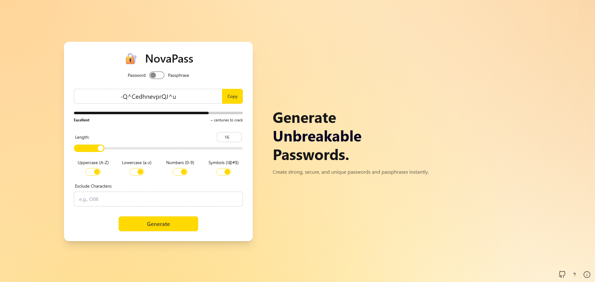

# NovaPass 🔐

A modern and feature-rich password and passphrase generator, built with Python/Flask and a responsive daisyUI frontend. This application is fully containerized with Docker for easy setup and deployment.

 

## ✨ Features

-   **Dual Generation Modes:** Create either standard random character **passwords** or memorable **passphrases** (diceware style).
-   **Highly Customizable Passwords:**
    -   Custom length from 8 to 1024 characters.
    -   Toggle Uppercase, Lowercase, Numbers, and Symbols.
    -   Exclude specific characters to avoid ambiguity (e.g., O, 0, I, l).
-   **Configurable Passphrases:**
    -   Choose the number of words.
    -   Use custom separators.
    -   Support for multiple external dictionary files.
-   **Real-time Strength Analysis:** An entropy-based progress bar and a "time to crack" estimate give instant feedback on the generated password's security.
-   **Modern & Responsive UI:**
    -   A dynamic, two-column layout for desktop views with an animated slogan.
    -   A clean, single-column layout for mobile.
    -   Automatic Light/Dark theme based on system preference.
    -   Smooth, fluid animated background.
-   **User-Friendly:** Includes integrated help and information modals, tooltips, and a one-click copy button.
-   **Ready for Deployment:** Fully containerized using Docker and Docker Compose for a consistent environment.

## 🛠️ Tech Stack

-   **Backend:** Python, Flask
-   **Frontend:** HTML, Tailwind CSS, daisyUI, Vanilla JavaScript
-   **WSGI Server:** Gunicorn
-   **Containerization:** Docker, Docker Compose

## 🚀 Getting Started

Follow these instructions to get a copy of the project up and running on your local machine.

### Prerequisites

-   [Docker](https://www.docker.com/get-started) and Docker Compose

### Installation

1.  **Clone the repository**
    ```bash
    git clone https://github.com/ClementLG/NovaPass.git
    cd novapass
    ```

2.  **Create the dictionaries folder**
    At the root of the project, create a folder named `dictionaries`. Place your wordlist files inside this folder (e.g., `english_ef.txt`, `french_diceware.txt`. Already included for quick start). The files must be plain text with **one word per line**.

3.  **Build and run with docker compose**
    This single command will build the Docker image and start the application.
    ```bash
    docker-compose up --build
    ```

4.  **Access the application**
    Once the container is running, open your web browser and navigate to:
    ```
    http://localhost:5000
    ```

### Recompiling CSS (optional)

This project includes a pre-compiled `output.css` file. If you want to make changes to the styles or HTML classes, you will need to recompile it.

1.  **Install Node.js dependencies:**
    ```bash
    npm install
    ```

2.  **Run the build command:**
    ```bash
    npm run build:css
    ```

## License

This project is licensed under the GNU General Public License v3.0 (GPLv3) - see the LICENSE file for details.